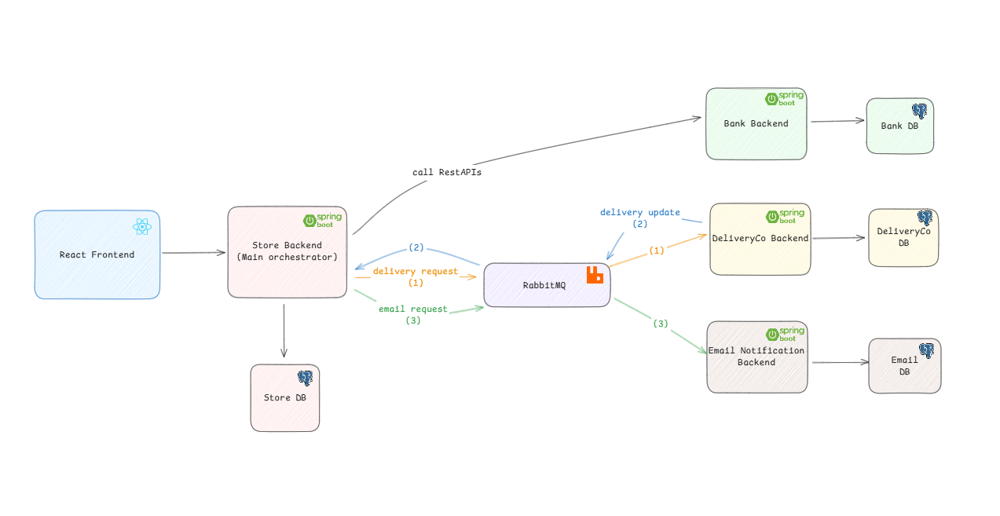
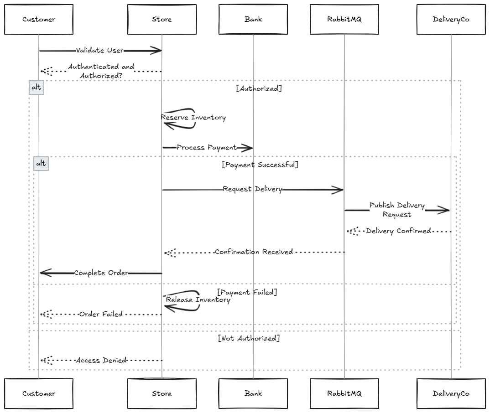
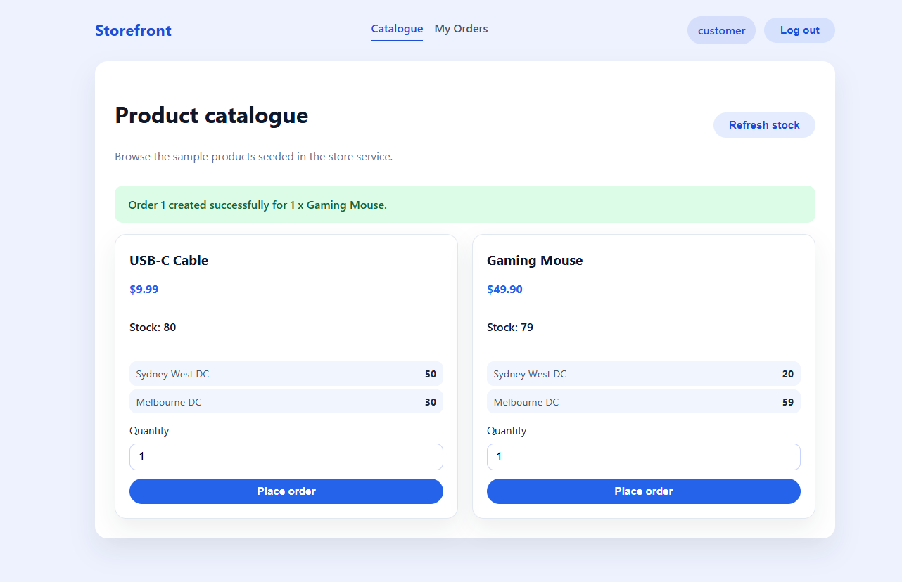
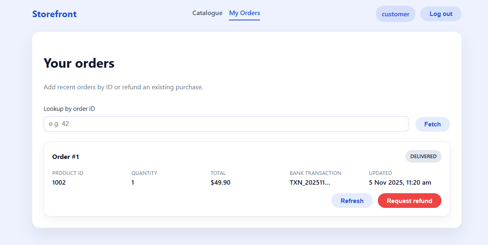
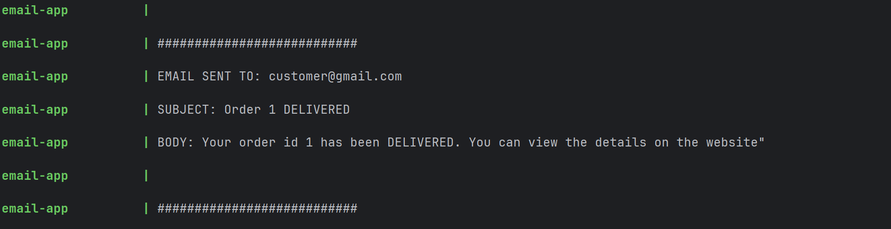

# _MicroCart_ - _Microservice Ecommerce System_

---

## Overview
This project implements an **enterprise-scale online store** using a **microservices architecture**, designed for **scalability**, **fault tolerance**, and **maintainability**.  
It features a **React (Vite)** frontend and multiple **Spring Boot backend services**, orchestrated together via **Docker Compose**.

All services, databases, and messaging queues are launched with a single command:

```bash
docker compose up --build
````

After startup, access the frontend at [http://localhost:5173](http://localhost:5173).

---

##  System Architecture

The system is designed around **microservices**, with each backend service responsible for a specific domain area.
All services communicate asynchronously using **RabbitMQ**, and persist data independently using **PostgreSQL** databases.





### Services Breakdown

| Service                | Description                                                                                                                           |
| ---------------------- |---------------------------------------------------------------------------------------------------------------------------------------|
| **Store Service**      | Central orchestrator that manages customers, products, orders, inventory, and coordinates order workflows using the **Saga pattern**. |
| **Bank Service**       | Handles payments and refunds, storing all transactions in PostgreSQL. Communicates with the Store via REST calls.                     |
| **DeliveryCo Service** | Processes delivery requests and updates via RabbitMQ. Publishes delivery status updates for order tracking.                           |
| **Email Service**      | Listens for queued email events (e.g., order confirmation, delivery updates) and sends or logs email notifications.                   |
| **RabbitMQ**           | Message broker for asynchronous communication between services.                                                                       |
| **PostgreSQL**         | Independent database instances per service.                                                                                           |
| **Frontend (React)**   | Simple interface for fault-torelance demo                                                                                             |

All services are containerized and run in a shared Docker network, allowing clean separation of responsibilities.

---

## Saga Pattern for Distributed Transactions

In distributed systems, achieving **ACID** consistency across services is challenging.
Our design uses the **Saga pattern** to maintain **eventual consistency** across multiple services during the order lifecycle.




### Saga Execution Flow

1. **Validate User** – Check if the customer is authenticated and authorized.
2. **Reserve Inventory** – Deduct product stock within a local transaction.
3. **Process Payment** – Call the Bank service (REST) to charge the customer.
4. **Request Delivery** – Publish a delivery request to RabbitMQ.
6. **Complete Order** – Mark the order as successful and update the saga state.

### Compensation Logic

If any step fails, the Saga orchestrator performs **compensating transactions** to revert previous successful steps:

* Release reserved inventory if payment fails
* Refund payment if delivery fails
* Mark order as failed with audit log

Saga state transitions are persisted to ensure recovery after a crash or restart.
This enables **idempotency** and **resumable orchestration** even under partial failures.


---


## Quality Attributes

| Attribute         | Implementation                                                 | Impact                                          |
| ----------------- | -------------------------------------------------------------- | ----------------------------------------------- |
| **Availability**  | Stateless services, horizontal scaling, asynchronous messaging | Reduces downtime, isolates failures             |
| **Reliability**   | Saga persistence, compensations, DLQs, idempotent operations   | Prevents data loss and inconsistencies          |
| **Scalability**   | Independent scaling per service                                | Supports growing workload with minimal coupling |
| **Performance**   | Parallel microservices, REST + RabbitMQ                        | Handles concurrent requests efficiently         |

---

## Tech Stack

| Layer                | Technology              |
| -------------------- | ----------------------- |
| **Frontend**         | React (Vite)            |
| **Backend Services** | Spring Boot (Java)      |
| **Messaging**        | RabbitMQ                |
| **Databases**        | PostgreSQL              |
| **Authentication**   | JWT (Stateless)         |
| **Containerization** | Docker & Docker Compose |

---

## How to Run & Test

```bash
# Run the entire system
docker compose up --build
```

Access:

* Frontend → [http://localhost:5173](http://localhost:5173)
* Store API → [http://localhost:8080](http://localhost:8080)
* RabbitMQ Management UI → [http://localhost:15672](http://localhost:15672)

Once running, you can:

**1. Register and log in from the frontend. **(username: customer, password: COMP5348)****


**2. Place an order → triggers the full Saga orchestration.**



**3. Check order status**


**4. Check logs from Email and Delivery services for simulated updates.**



---

